<div align="center">

<!-- HEADER WAVE -->


<!-- TYPING SVG — using demolab (herokuapp is deprecated) -->
<a href="https://pmorales.vercel.app/">
    
</a>

<br/>

[](https://pmorales.vercel.app/)
[](https://linkedin.com/in/pablo-david-morales-1a39bb255)
[](mailto:pablo.moralesm355@gmail.com)
[](https://github.com/pmoralesm355)

</div>

<!-- NEOFETCH SVG -->
<div align="center">

</div>

---

<div align="center">

### `>> whoami`

</div>

```python
class Pablo:
    def __init__(self):
        self.name       = "Pablo David Morales Martinez"
        self.role       = "Full Stack Cloud Integration Engineer"
        self.company    = "Olive Tech GT"
        self.location   = "Guatemala"
        self.education  = ["B.Sc. Systems Engineering", "M.Sc. Cybersecurity (in progress)"]
        self.experience = "4+ years"

    def current_focus(self):
        return [
            "Architecting secure API gateways on Google Cloud Platform",
            "Designing integration-first distributed systems",
            "Expanding cybersecurity expertise through Master's program",
            "Exploring AI/ML for intelligent automation"
        ]

    def philosophy(self):
        return "Security-first. Clean architecture. Measurable impact."
```

---

<div align="center">

### `>> cat tech_stack.yml`

<br/>

#### `// Frontend`


#### `// Backend & APIs`


#### `// Cloud & DevOps`


#### `// Data & AI/ML`


#### `// Security`


</div>

---

<div align="center">

### `>> ls certifications/`

</div>

<br/>

<table align="center">
<tr>
<td align="center" width="50%">


**Scrum Fundamentals Certified (SFC)**

`Scrum principles, roles, events & artifacts`

[](https://www.scrumstudy.com/certification/verify?type=SFC&number=1102133)

</td>
<td align="center" width="50%">


**Project Management Fundamentals**

`Planning, execution, monitoring & stakeholders`

[](https://www.credly.com/earner/earned/badge/db47ae63-7080-472f-99d9-5d357860e0cd)

</td>
</tr>
<tr>
<td align="center" width="50%">


**AWS DevOps Engineer Pro 2024**

`CI/CD pipelines, automation & IaC on AWS`

[](https://skillsoft.digitalbadges.skillsoft.com/47be569d-fe4a-4121-87fc-e5825a2bddb2#acc.bAtqfioh)

</td>
<td align="center" width="50%">


**Career Essentials in Cybersecurity**

`Threat landscape, IAM & security operations`

[](https://www.linkedin.com/learning/certificates/d83a0b37a7f735f48115e5ed0849202e602c3b43c14bdad258e4b83385e51ad2)

</td>
</tr>
</table>

---

<div align="center">


<br/>


</div>
